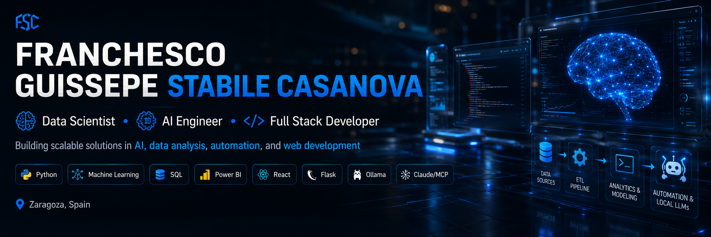
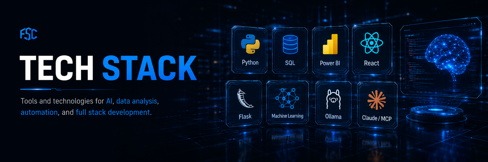
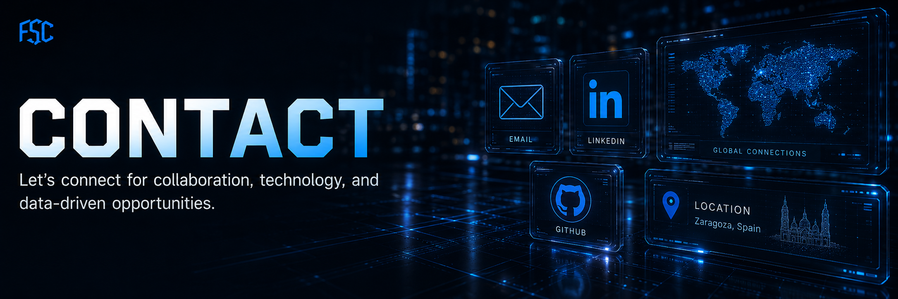

  

# Hola, soy Franchesco Stabile

Soy **Data Scientist & AI Engineer** con base en Zaragoza, España. Combino desarrollo full stack, análisis de datos, Machine Learning y automatización con inteligencia artificial para crear soluciones útiles, medibles y escalables.

Trabajo especialmente bien en proyectos donde hay procesos manuales, datos dispersos o necesidades reales de negocio que pueden mejorar con software, dashboards, pipelines de datos o automatizaciones con IA.

## Qué puedo aportar

- Construcción de pipelines de datos, limpieza, análisis exploratorio y modelado predictivo.
- Dashboards e indicadores para visualizar KPIs y apoyar la toma de decisiones.
- Automatización de documentación y procesos internos con LLMs locales, Ollama y Claude/MCP.
- Desarrollo de aplicaciones web con Python, Flask, React, HTML, CSS y JavaScript.
- Visión práctica de industria, trazabilidad, formación operativa y mejora continua.

## Stack principal

  

**Lenguajes y desarrollo:** Python, JavaScript, React, HTML5, CSS3, Flask  
**Datos y visualización:** Pandas, NumPy, SQL, SQLite, Power BI, Streamlit, Matplotlib  
**Machine Learning:** Scikit-learn, XGBoost, EDA, Feature Engineering  
**IA y automatización:** Ollama, LM Studio, Claude/MCP, Prompt Engineering, AI Automation  
**Herramientas:** GitHub, Visual Studio Code, Claude Code, Codex, Antigravity  
**Sistemas:** Windows, Linux, macOS, VMware, VPS

## Proyectos destacados

### FAOSTAT Bioenergía ML

Modelo de Machine Learning para estimar bioenergía por país, año e ítem usando datos de FAOSTAT. Incluye ingesta, EDA, limpieza, transformación y entrenamiento de modelos predictivos.

[Ver repositorio](https://github.com/Dragcessa1998/Proyecto-Final-4geeks-bioenerg-a-en-el-sector-agroalimentario)

### Modisprem Learning Hub

PWA orientada a la gestión de formación industrial en fábrica. El objetivo es digitalizar, organizar y trazar la capacitación de operarios en producción.

### Web Scraping Spotify

Extracción, limpieza y almacenamiento de datos musicales con Python, Pandas y SQLite para convertir información cruda en datos analizables.

### Análisis World Bank

Obtención, limpieza y visualización de datos económicos del Banco Mundial para comparar indicadores, detectar tendencias y construir visualizaciones con Power BI.

## Experiencia

**Maquinista y Técnico de Proyectos Digitales - Modisprem S.A**  
Zaragoza | 09/2023 - Presente

- Diseño de prompts y automatizaciones con Ollama y Claude/MCP.
- Automatización de documentación y procesos industriales internos.
- Mejora técnica de web corporativa, UX, SEO y posicionamiento.
- Operación de maquinaria industrial Baumer para fabricación de piezas destinadas a Volkswagen, BMW, Audi y Mercedes-Benz.

**Técnico Informático - Measwind Renovable Services**  
Zaragoza | 09/2022 - 07/2023

- Diagnóstico y resolución de incidencias de hardware y software.
- Configuración de redes, recuperación de datos y mantenimiento preventivo.
- Apoyo técnico en entornos de energías renovables.

## Formación y certificaciones

- Bootcamp en AI Engineering - 4Geeks Academy España | 06/2026 - 01/2027
- Bootcamp en Análisis y Ciencia de Datos - 4Geeks Academy España | 11/2025 - 05/2026
- Grado Superior en Desarrollo de Aplicaciones Web - Océano Atlántico | 2024 - Presente
- Máster en Programación Full Stack - Davante | 11/2025 - 05/2026
- Data Science and Machine Learning - 4Geeks Academy España
- Ciberseguridad e inteligencia artificial - Universidad San Jorge / Grupo San Valero
- Digitalización con inteligencia artificial para pymes - Universidad San Jorge

## En qué estoy enfocado ahora

- AI Engineering aplicado a procesos reales.
- Machine Learning con Python y Scikit-learn.
- Dashboards y análisis de datos para negocio.
- Automatizaciones con LLMs locales.
- Aplicaciones web full stack y PWAs.

## GitHub

  
  

## Trabajemos juntos

Estoy abierto a colaborar en proyectos de **datos, IA aplicada, automatización, desarrollo web y soluciones para industria**. Si tienes una idea, un proceso que quieres mejorar o datos que necesitas convertir en decisiones, podemos hablar.

  

- LinkedIn: [Franchesco Guissepe Stabile Casanova](https://www.linkedin.com/in/franchesco-guissepe-stabile-casanova-b67142207/)
- GitHub: [Dragcessa1998](https://github.com/Dragcessa1998)
- Email: [frangsc2022@gmail.com](mailto:frangsc2022@gmail.com)

---

  Data Science | AI Engineering | Automation | Full Stack Development

